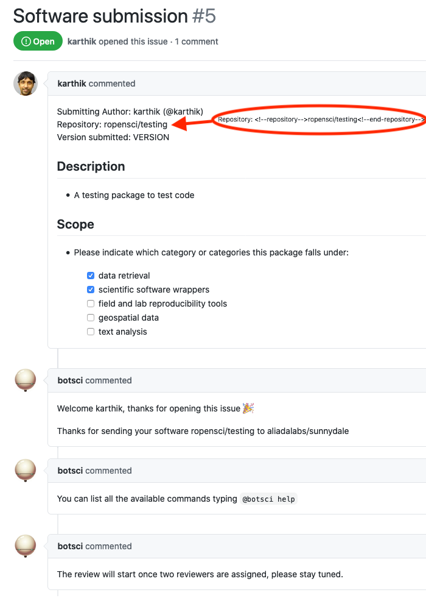
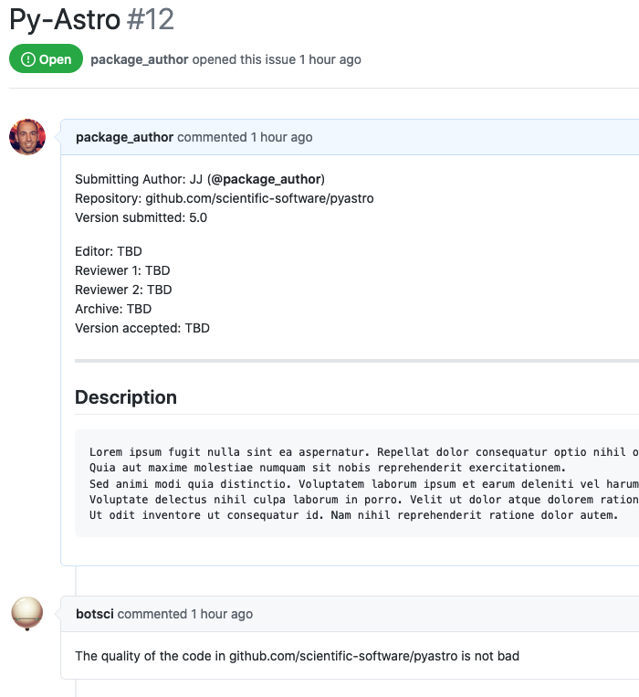

Welcome
=======

This responder acts when a new issue is opened. It can reply with text messages, using a template, create a background job to asynchronously call an external service's API and/or triggering another responder.

Allows [labeling](../labeling).

## Listens to

New issue opened event.

## Settings key

`welcome`

## Requirements

### When using a template to respond:

When rendering a template a map of values will be passed to it:
- **issue_id**: The id of the issue
- **repo**: the name of the repository
- **sender**: the handle of the user creating the issue
- **bot_name**: the name of the bot user responding

If the template needs some other value included in the body of the issue, they can be declared using the `data_from_issue` param and those values will be passed to the template too, if can be extracted from the body. They can be used in the template using the syntax:
```
{{variable_name}}
```

In order to use a template, Buffy will look for the file declared in the `template_file` param in the target repo, in the location specified with the `template_path` setting (by default `.buffy/templates`). In short: the *template_file* should be located in the *template_path*.

The values needed by the template that are listed in the `data_from_issue` param must be extractable: they have to be enclosed in HTML comments:

```html
<!--<name>--> Info to extract <!--end-<name>-->
```
So, for example, if you want to use the value of _version_ in the template, the body of the issue must include it inside HTML comments:
```html
<!--version--> v2.1 <!--end-version-->
```
Then it should be declared in the settings file, listed in the _data_from_issue_ param:
```yaml
  responders:
    welcome:
      template_file: welcome.md
      data_from_issue:
        - version
```

And can then be used in the template:
```
Thank you for your submission, we will review the {{version}} release of your software.
```

### When invoking an external service:

Some parameters are required for the external call to work: the `name` of the service and the `url` of the call, both configured in the settings YAML file nested under the `external_service` param.

Similarly to the [External Service responder](./external_service) if the call is successful the response is posted as a comment in the issue (optionally using a template).

You can configure a template file as a response after the external API call, this template is configured separately from the previous general response template. The response from the external service should be in JSON format. It will be parsed and the resulting hash values will be passed to the template.

## Params

For replying with plain text message(s):
```eval_rst
:message: A text message to use as reply.
:messages: *<Array>* A list of text messages to respond with.

```

To reply with a template file:
```eval_rst
:template_file: The name of the template file to use to build the response message.
:data_from_issue: *<Array>* An optional list of values that will be extracted from the issue's body and used to fill the template.

```

Calling an external service:
```eval_rst
:external_service: All the configuration for the service is nested under this param. Posible options are:

  :name: *Required*. The name for this service.
  :url: *Required*. The url to call.
  :method: The HTTP method to use. Valid values: [get, post]. Default is **post**.
  :template_file: The optional template file to use to build the response message after the external call.
  :headers: *<Array>* An optional list of *key: value* pairs to be passed as headers in the external service request.
  :data_from_issue: *<Array>* An optional list of values that will be extracted from the issue's body and used to fill the template.
  :query_params: *<Array>* An optional list of params to add to the query of the external call. Common place to add API_KEYS or other authentication info.
  :mapping: *<Array>* An optional mapping of variable names in the query of the external service call.

```

Running other responder(s):
```eval_rst
:run_responder: Allows to call a different responder. Subparams are:

  :responder_key: *Required*. The key to find the responder in the config file.
  :responder_name: *Optional*. The name of the responder in the config file if there are several instances under the same responder key.
  :message: *Optional*. The message to trigger the responder with.

```
If you want to run multiple responders, use an array of these subparams.


General:
```eval_rst
:close: *<Boolean>* Optional parameter, if **true** the responder will close the issue. Default is **false**.
:check_references: Optional. If present the validity of the DOIs from the paper’s references file will be checked.
:repo_checks: Optional. If present the responder will perform (asynchronously) several checks on the target repository. You can configure which checks to perform using nested params. Available options are those of the `repository_checks responder`_
:hidden: Is **true** by default.

.. _`repository_checks responder`: ./repo_checks.html#params

```

## Examples

**Simplest use case:**
```yaml
...
  responders:
    welcome:
      message: "Thanks for your submission!"
...
```

**Multiple messages and a template:**
```yaml
...
  responders:
    welcome:
      messages:
        - "You can list all the available commands typing `@botsci help`"
        - "The review will start once two reviewers are assigned, please stay tuned."
      template_file: welcome.md
      data_from_issue:
        - repository
        - version
...
```

**Calling an external service:**
```yaml
...
  responders:
    welcome:
      external_service:
        url: https://dummy-external-service.herokuapp.com/code-analysis
        method: post
        query_params:
          secret: A1234567890Z
        data_from_issue:
          - target-repo
        mapping:
          id: issue_id
...
```
When a new issue is created the responder will send a POST request to https://dummy-external-service.herokuapp.com/code-analysis with a JSON body:
```
{
 "secret": "A1234567890Z", # declared in the query_params setting
 "target-repo":"...",      # the value is extracted from the body of the issue
 "id":"...",               # the value corresponds to issue_id, it has been mapped to id
 "repo":"...",             # the origin repo where the invocation happend
 "sender":"...",           # the user invoking the command
 "bot_name":"...",         # the bot user name that will be responding
}
```
And the response from the external service will posted as a comment in the original issue.

## In action

### Text messages and template file:

* **`The template file:`**


* **`In use (template + 2 messages):`**



### Calling an external service:


